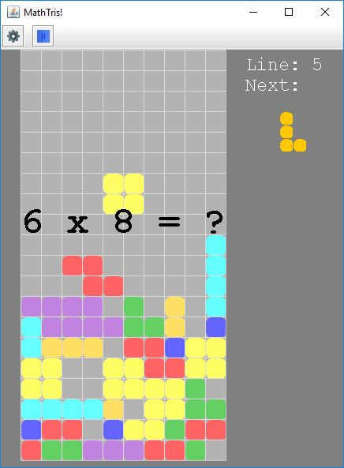

# MathTris

An educational Tetris Game!  
The goal is to solve a mental calculation to be able to move the tile.

## Development progress

* [x] Move Left/Right
* [x] Fast down
* [x] Rotate Left/Right (But you can participate by improving the algorithm)
* [x] Line count
* [x] Equation mode (default)
* [x] End game
* [ ] New game
* [ ] Score
* [x] Game settings
* [x] Remove complete line
* [x] Collision management
* [x] Pause
* [x] Equation generator

